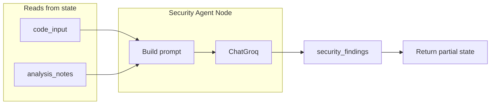

# Stage 4: Build Security Agent — Plan

## Goal (from [ProblemSTatement.txt](ProblemSTatement.txt))

- **Reads:** `code_input`, `analysis_notes`
- **Focus:** Injection risks, hardcoded secrets, input validation issues
- **Stores:** `security_findings`

## Current codebase

- **State:** [backend/app/state.py](backend/app/state.py) already defines `security_findings`; Security Agent writes it, Aggregator reads it.
- **Pattern:** [backend/app/agents/code_analyzer.py](backend/app/agents/code_analyzer.py) shows the pattern: prompt template(s), node function `(state: ReviewState) -> dict`, `get_llm().invoke(prompt)`, return single-key partial update.
- **LLM:** [backend/app/llm.py](backend/app/llm.py) provides `get_llm()`.

## Design

- **Node:** `security_agent_node(state: ReviewState) -> dict`
  - Read `code_input` and `analysis_notes` (use `.get("analysis_notes", "")` so it works if analyzer was skipped).
  - Build a prompt that includes the code and prior analysis, asking the LLM to focus on injection risks, hardcoded secrets, and input validation; output plain text.
  - Call `get_llm().invoke(prompt)`, return `{"security_findings": response.content}`.

## Implementation steps

### 1. Add Security Agent module

- Add [backend/app/agents/security_agent.py](backend/app/agents/security_agent.py):
  - **Prompt template:** One prompt (with optional `{language}` if you want) that:
    - Says you are a security-focused code reviewer.
    - Lists focus areas: injection risks (SQL, command, etc.), hardcoded secrets/credentials, input validation issues.
    - Includes placeholders for `{code}` and `{analysis_notes}` so the model can use prior analysis for context.
  - **Node function:** `def security_agent_node(state: ReviewState) -> dict`:
    - `code_input = state["code_input"]`
    - `analysis_notes = state.get("analysis_notes") or ""`
    - Optionally `language = state.get("language") or ""`
    - Build prompt, invoke `get_llm()`, return `{"security_findings": response.content}`.
  - Use the same import style as [backend/app/agents/code_analyzer.py](backend/app/agents/code_analyzer.py) (`from app.llm import get_llm`, `from app.state import ReviewState`). You will verify or add imports after the code is written.

### 2. Export the node

- In [backend/app/agents/**init**.py](backend/app/agents/__init__.py): import `security_agent_node` from `security_agent` and add it to `__all`__.
- In [backend/app/**init**.py](backend/app/__init__.py): import `security_agent_node` from `.agents` and add it to `__all`__.

### 3. Optional: standalone test script

- Add [backend/run_security.py](backend/run_security.py) that:
  - Builds state with `create_initial_state(snippet, "python")`, then runs `code_analyzer_node(state)` and merges the result into `state` (so Security gets `analysis_notes`).
  - Calls `security_agent_node(state)` and prints `security_findings`.
  - Same path setup as [backend/run_analyzer.py](backend/run_analyzer.py) when run from project root.

### 4. No graph yet

- Do not add LangGraph or StateGraph in this stage; that remains Stage 7.

## Files to add/change

| File                                                                         | Action                                                                   |
| ---------------------------------------------------------------------------- | ------------------------------------------------------------------------ |
| [backend/app/agents/security_agent.py](backend/app/agents/security_agent.py) | **Add** – Prompt template and `security_agent_node(state)`.              |
| [backend/app/agents/**init**.py](backend/app/agents/__init__.py)             | **Change** – Export `security_agent_node`.                               |
| [backend/app/**init**.py](backend/app/__init__.py)                           | **Change** – Export `security_agent_node`.                               |
| [backend/run_security.py](backend/run_security.py)                           | **Add (optional)** – Test script that runs analyzer then security agent. |

## After code writing is done

You asked to be told about imports after implementation. The implementation will use the same import pattern as the Code Analyzer (`app.llm`, `app.state`). The only changes you need to apply yourself (if not already done in the plan implementation) are:

- **In `backend/app/agents/__init__.py`:** Add `from app.agents.security_agent import security_agent_node` and add `"security_agent_node"` to `__all`__.
- **In `backend/app/__init__.py`:** Add `security_agent_node` to the import from `.agents` and to `__all_`_.

If the plan is implemented as specified, these edits will already be in place; you only need to run the app from the `backend` directory (or with `backend` on `PYTHONPATH`) so that `app` resolves correctly.

## Summary

- Add `security_agent.py` with a security-focused prompt and `security_agent_node(state)` that reads `code_input` and `analysis_notes`, calls Groq, and returns `{"security_findings": ...}`.
- Wire `security_agent_node` into `app.agents` and `app` exports.
- Optionally add `run_security.py` to test the Security Agent after the Code Analyzer. No new dependencies; no graph in this stage.

