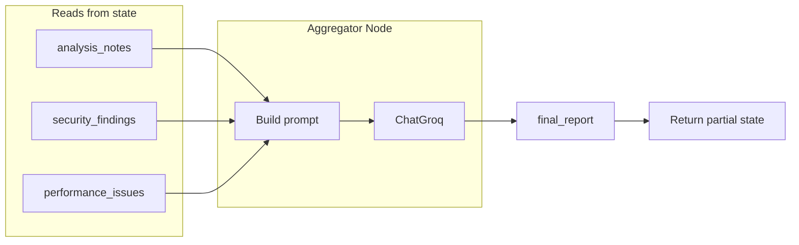

# Stage 6: Build Aggregator Agent — Plan

## Goal (from [ProblemSTatement.txt](ProblemSTatement.txt))

- **Reads:** `analysis_notes`, `security_findings`, `performance_issues`
- **Produces:** Structured JSON, categorized severity, clean summary
- **Stores:** `final_report` (read by API in Stage 8)

## Current codebase

- **State:** [backend/app/state.py](backend/app/state.py) defines `final_report`; Aggregator writes it.
- **Pattern:** Other agents in [backend/app/agents/](backend/app/agents/) use a prompt template, `(state: ReviewState) -> dict`, `get_llm().invoke()`, return single-key update.
- **LLM:** [backend/app/llm.py](backend/app/llm.py) provides `get_llm()`.

## Design

- **Node:** `aggregator_agent_node(state: ReviewState) -> dict`
  - Read `analysis_notes`, `security_findings`, `performance_issues` from state (use `.get(..., "")` so missing keys don’t break the node).
  - Build a prompt that includes all three inputs and instructs the LLM to output a **single JSON object** with:
    - A short **summary** (e.g. 2–3 sentences).
    - **Sections** for code quality, security, and performance, each with **severity** (e.g. high/medium/low) and the relevant findings.
  - Call `get_llm().invoke(prompt)`, then return `{"final_report": response.content}`.
- **Output format:** Ask for valid JSON in the prompt (e.g. keys like `summary`, `code_quality`, `security`, `performance`, each with `severity` and `findings` or similar). Store the raw string in `final_report`; Stage 8 can return it as-is or parse and re-serialize. No need to parse/validate JSON inside the agent unless you want to; keeping it as a string is enough for this stage.




## Implementation steps

### 1. Add Aggregator Agent module

- Add [backend/app/agents/aggregator_agent.py](backend/app/agents/aggregator_agent.py):
  - **Prompt template:** Instruct the LLM to combine the three inputs into one JSON document with:
    - `summary`: short overall summary (string).
    - Sections for code quality (from analysis_notes), security (from security_findings), performance (from performance_issues), each with a severity (e.g. high/medium/low) and findings text.
    - Explicit instruction: output only valid JSON, no markdown code fences (or allow

```json and strip in code if you prefer).
  - **Node function:** `def aggregator_agent_node(state: ReviewState) -> dict`:
    - `analysis_notes = state.get("analysis_notes") or ""`
    - `security_findings = state.get("security_findings") or ""`
    - `performance_issues = state.get("performance_issues") or ""`
    - Build prompt with these three, invoke `get_llm()`, return `{"final_report": response.content}`.
  - Imports: `from app.llm import get_llm`, `from app.state import ReviewState`.

### 2. Export the node

- In [backend/app/agents/__init__.py](backend/app/agents/__init__.py): import `aggregator_agent_node` from `aggregator_agent` and add it to `__all`__.
- In [backend/app/__init__.py](backend/app/__init__.py): import `aggregator_agent_node` from `.agents` and add it to `__all`__.

### 3. Optional: standalone test script

- Add [backend/run_aggregator.py](backend/run_aggregator.py) that:
  - Builds initial state with a small code snippet.
  - Runs in sequence: `code_analyzer_node` → merge, `security_agent_node` → merge, `performance_agent_node` → merge, then `aggregator_agent_node`.
  - Prints `final_report` (and optionally validates that it’s parseable JSON).
  - Same path setup as [backend/run_security.py](backend/run_security.py) / [backend/run_performance.py](backend/run_performance.py).

### 4. No graph yet

- Do not add StateGraph or workflow in this stage; that is Stage 7.

## Files to add/change

| File | Action |
|------|--------|
| [backend/app/agents/aggregator_agent.py](backend/app/agents/aggregator_agent.py) | **Add** – Prompt template and `aggregator_agent_node(state)`. |
| [backend/app/agents/__init__.py](backend/app/agents/__init__.py) | **Change** – Export `aggregator_agent_node`. |
| [backend/app/__init__.py](backend/app/__init__.py) | **Change** – Export `aggregator_agent_node`. |
| [backend/run_aggregator.py](backend/run_aggregator.py) | **Add (optional)** – Test script: run analyzer, security, performance, then aggregator; print final_report. |

## Suggested JSON shape (for the prompt)

You can ask the LLM to produce something like:

```json
{
  "summary": "Brief overall summary.",
  "code_quality": { "severity": "medium", "findings": "..." },
  "security": { "severity": "high", "findings": "..." },
  "performance": { "severity": "low", "findings": "..." }
}
```

The exact keys can be adjusted in the prompt; the important part is structured output with severity and a clean summary so the API (Stage 8) can return a consistent shape.

## Summary

- Add `aggregator_agent.py` with a prompt that combines `analysis_notes`, `security_findings`, and `performance_issues` into one structured JSON report (summary + categorized severity).
- Implement `aggregator_agent_node(state)` that reads those three fields, calls Groq, and returns `{"final_report": response.content}`.
- Wire `aggregator_agent_node` into `app.agents` and `app` exports; optionally add `run_aggregator.py` to run the full chain (analyzer → security → performance → aggregator) without the graph.

